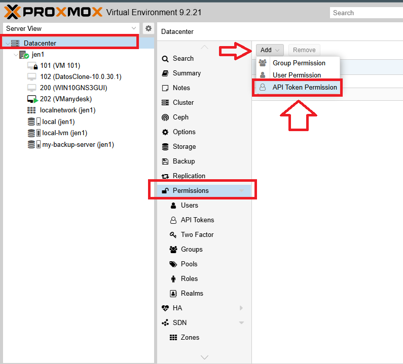
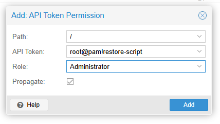

# Technical Documentation: Automated VM Restoration from Proxmox Backup Server (PBS)

## Universal Script
**Miguelangel Luna**

---

[Proxmox Backup Server](https://www.proxmox.com/en/downloads/proxmox-backup-server)

## 1. Introduction and Theoretical Framework

### Proxmox Backup Server (PBS):
Proxmox Backup Server is an open-source enterprise backup solution designed to back up and restore virtual machines (VMs), containers (CTs), and physical hosts. It utilizes **chunk-based deduplication, meaning only new or modified blocks of data are stored during each backup, drastically reducing disk space usage and optimizing network bandwidth.**

### Virtual Machine Recovery Process
Recovering (restoring) a VM involves rebuilding its virtual disks and configuration files from a snapshot stored on the PBS. The standard process in Proxmox VE (PVE) relies on native commands such as `qmrestore` and low-level tools (`pbs-restore`), which:
1. Query metadata and block indexes of the backup from the remote server.
2. Allocate the required virtual volumes in the local node storage (e.g., `local-lvm`).
3. Discover and concurrently download missing data chunks from the PBS repository to write them to the target disks.

### The `jq` Tool
`jq` is a lightweight and flexible command-line JSON processor. In the context of this script, it is completely indispensable because the Proxmox VE REST API responds exclusively in JSON format. `jq` allows you to filter, parse, and extract specific data—such as available PBS storage lists or snapshot identifiers—cleanly inside shell scripts.

---

## 2. Prerequisites
Before deploying and executing the script on any new Proxmox VE server, ensure the following requirements are met:
1. **Proxmox VE Connected to PBS:** The PVE node must have the Proxmox Backup Server storage added to its configuration.
2. **Dependency Installation (`jq`):** The JSON processor must be present on the base operating system.
3. **Proxmox API Token:** An authentication token with administrator privileges is required to interact with the local API without needing plain-text passwords.

## 3. Implementation and Deployment Steps
Follow these steps on any new Proxmox VE server to make the restoration script fully operational:

### Step 1: Install the `jq` Dependency
Run the following command in the terminal to install the JSON processor:

**JQ Tool (pve shell)**

```text
apt update && apt install -y jq
```

### Step 2: Create the API Token in Proxmox VE
To allow the script to communicate with the Proxmox API automatically:
1. Access the Proxmox VE web interface.
2. Navigate to **Datacenter** > **Permissions** > **API Tokens** > **Add**.
3. Configure the following parameters:
   - **User:** `root@pam`
   - **Token ID:** `restore-script`
   - **Privilege Separation:** Uncheck (to inherit full root permissions).




     
4. Copy the generated **Secret** value (it is only shown once).

### Step 3: Configure the Credentials File on the Node
Create the token file in the path expected by the script and assign restrictive security permissions:

```text
echo 'root@pam!restore-script=YOUR_SECRET_HERE' > /root/.pve_api_token
```
*(Replace `YOUR_SECRET_HERE` with the actual secret obtained in Step 2).*

```text
chmod 600 /root/.pve_api_token
```

### Step 4: Create and Host the Script
Create a directory for your administration tools and save the script:

```text
mkdir -p /root/scripts/restorefrompbs
nano /root/scripts/restorefrompbs/restorefrompbs.sh
```
Paste the script code, save it, and grant it execution permissions:

```text
chmod +x /root/scripts/restorefrompbs/restorefrompbs.sh
```
--------------------------

