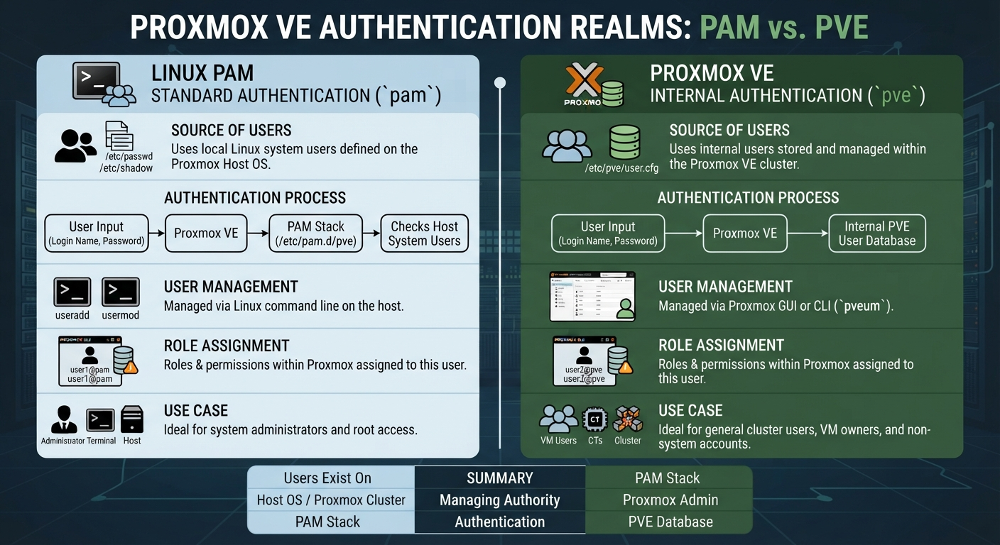

# TECHNICAL LOG & PROXMOX SERVER

## USER ACCESS
**CCNP Miguelangel Luna**

---

## CONTENT:

| Case | Title | Description |
| :--- | :--- | :--- |
| **01** | [Claude & n8n AI Agents](./case-01-Google-Auth/) | Agentes Claude . |

[Google](https://www.google.com)

## 1. Introduction and Theoretical Framework

## 1. PAM Realm vs. PVE Realm

Proxmox manages different types of authentication called realms:



* **Linux PAM Realm (`pam`):** Authenticates directly against the underlying host operating system users (those that exist in `/etc/passwd` and `/etc/shadow`).
* **Proxmox VE Realm (`pve`):** Uses Proxmox's own internal database (`/etc/pve/user.cfg`) managed through the web interface or CLI, independent of Linux system users.

> **Technical Note:** PAM is used to authenticate users against the underlying Linux operating system accounts (the Proxmox host).

**Important Considerations:**

* **User creation:** For a user to log in via PAM, you must first create them at the system level on the Proxmox host using standard Linux commands (such as `useradd` or `adduser`).
* **Permissions:** Although the user authenticates through Linux PAM, specific permissions for VM, containers, or storage must be configured within Proxmox (`Datacenter -> Permissions`).

## 2. Implementation:

## Procedure Summary (Structured and Optimized)

The objective is to change the root password using a temporary administrative account `backupuser`, and then recreate `backupuser` with administrator permissions within Proxmox for secure use.

### PHASE 1: Preparing the backupuser account in the Operating System (Debian Host)

These steps must be executed as `root` in the host terminal.

* **2.1) Create the user backupuser (if it does not exist):**
```bash
adduser backupuser
```
> **Note:** You will be prompted to set a password for `backupuser`.

* **2.2) Add the user to the sudo group to obtain administrative privileges:**

```bash
usermod -aG sudo backupuser
```

* **2.3) Quick verification (Optional, to confirm group membership):**

```bash
getent group sudo
```
## System Administrator Procedure

> **Technical Note:** The following administrative workflow standardizes user provisioning, privilege assignment, and credential updates for secure cluster management.

* **2.4) Switch to the `backupuser` account and verify the session:**

```bash
su - backupuser
```
whoami # Should return: backupuser

* **2.5)Execute the root password change (you will be prompted for the `backupuser` password first, and then the new root password twice):**

```bash
sudo passwd root
```

### PHASE 3: Creation and Permissions in Proxmox VE (`pve`)

These steps are executed in the host terminal, either as `root` or as `backupuser` via `sudo`.

* **2.6)Create the user in Proxmox VE (using the PAM realm to authenticate against the operating system):**

```bash
pveum user add backupuser@pam 
```

* **2.7)Assign the Administrator role to the created user across the entire Proxmox VE Datacenter:**

```bash
pveum acl modify / -users backupuser@pam -roles Administrator
```

### 4. BGP Configuration:
